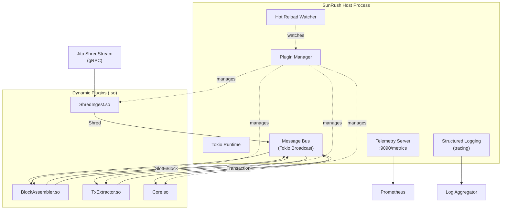
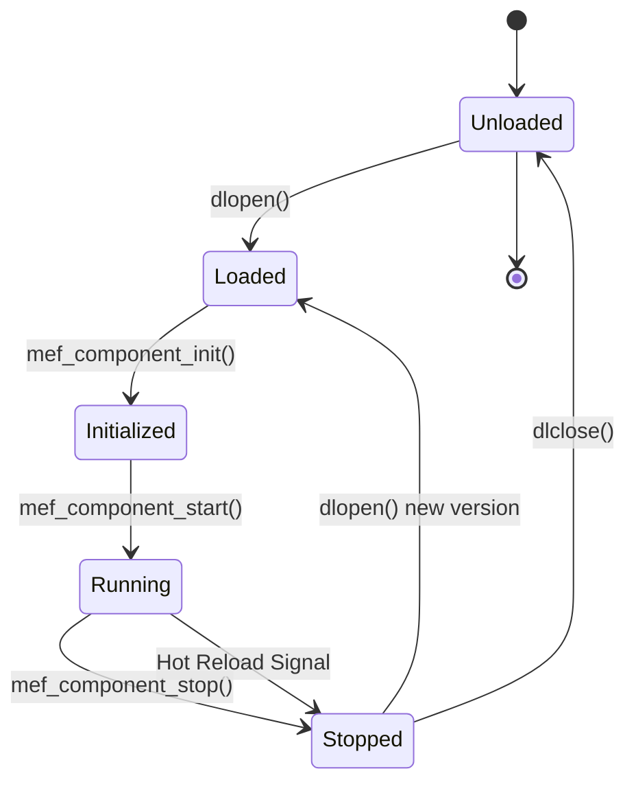

# SunRush Architecture

**Version:** 1.0  
**Last Updated:** December 3, 2025

## Table of Contents

1. [System Overview](#system-overview)
2. [Design Principles](#design-principles)
3. [Component Architecture](#component-architecture)
4. [Data Flow](#data-flow)
5. [Plugin System](#plugin-system)
6. [Message Bus](#message-bus)
7. [Performance Design](#performance-design)
8. [Error Handling](#error-handling)
9. [Concurrency Model](#concurrency-model)

---

## System Overview

SunRush is a high-performance, modular system for extracting Solana transactions from raw network data (shreds) with minimal latency. The architecture prioritizes:

- **Speed**: Sub-millisecond latency per processing stage
- **Modularity**: Hot-reloadable plugins via stable ABI
- **Reliability**: Isolated failure domains
- **Observability**: Comprehensive metrics and structured logging

### Architecture Diagram



---

## Design Principles

### 1. **Single Process Architecture**

All components run in a single process to minimize:
- Inter-process communication overhead
- Serialization/deserialization costs
- Context switching
- Memory copies

Benefits:
- Zero-copy message passing via shared memory
- Lock-free communication channels
- Simplified deployment
- Reduced operational complexity

### 2. **Plugin-Based Modularity**

Each functional component is a separate `.so` library:

```
/opt/sunrush/plugins/
├── sunrush_shred_ingest.so
├── sunrush_block_assembler.so
├── sunrush_tx_extractor.so
└── sunrush_core.so
```

**Benefits:**
- Independent development and testing
- Hot reload without downtime
- Isolated failure domains
- Version-specific plugin loading

### 3. **Stable ABI Contract**

Plugins communicate with the host via a versioned C ABI:

```c
// Host provides to plugins
struct HostCallbacks {
    void (*log_info)(const char* msg);
    void (*log_error)(const char* msg);
    int (*publish)(uint8_t msg_type, const void* data, size_t len);
    void (*incr_counter)(const char* name);
    void (*observe_histogram)(const char* name, double value);
};

// Plugins must export
void* mef_component_init(const HostCallbacks*, const char* config);
int mef_component_start(void* handle);
int mef_component_stop(void* handle);
const char* mef_component_info();
```

This ensures binary compatibility across plugin versions.

### 4. **Streaming-First Processing**

Data is processed incrementally:

```
Shred arrives → Insert into slot → Entry becomes available → Emit SlotEntry
                                                            → Decode immediately
                                                            → Emit Transaction
```

No waiting for complete slots before processing.

### 5. **Zero-Allocation Paths**

Critical paths use:
- Pre-allocated buffers
- Memory pools
- `Arc<Bytes>` for shared ownership
- Zero-copy slicing

---

## Component Architecture

### Host Process

**Responsibilities:**
- Initialize Tokio runtime
- Load and manage plugins
- Provide message bus
- Serve telemetry endpoint
- Handle hot reload events
- Coordinate graceful shutdown

**Key Modules:**

```rust
// crates/host/src/
├── main.rs              // Entry point, runtime setup
├── plugin_manager.rs    // Plugin loading, lifecycle
├── bus.rs               // Message bus implementation
├── telemetry.rs         // Metrics server
├── config.rs            // Configuration parsing
└── hot_reload.rs        // File watcher, reload logic
```

### ShredIngest Plugin

**Purpose:** Read shreds from Jito ShredStream with minimal latency.

**Implementation:**
```rust
// plugins/shred-ingest/src/lib.rs

pub struct ShredIngest {
    client: JitoShredStreamClient,
    bus: BusSender,
    metrics: Metrics,
}

impl ShredIngest {
    async fn ingest_loop(&mut self) {
        loop {
            let shred = self.client.recv_shred().await?;
            
            // Minimal validation
            if !shred.is_valid() {
                self.metrics.invalid_shreds.inc();
                continue;
            }
            
            // Publish immediately
            let latency = shred.receive_time.elapsed();
            self.bus.publish(BusMessage::Shred(shred))?;
            self.metrics.ingest_latency.observe(latency);
        }
    }
}
```

**Performance Characteristics:**
- Async I/O (Tokio)
- Zero-copy from network buffer to bus
- <1ms from network receive to bus publish

### BlockAssembler Plugin

**Purpose:** Assemble shreds into slot entries and complete blocks.

**Data Structures:**

```rust
struct SlotState {
    slot: u64,
    shreds: HashMap<u32, Arc<Bytes>>,  // index -> data
    last_shred_index: Option<u32>,
    emitted_entries: BTreeSet<u32>,
    created_at: Instant,
}

struct BlockAssembler {
    active_slots: HashMap<u64, SlotState>,
    bus: BusHandle,
    config: Config,
}
```

**Processing Logic:**

```rust
impl BlockAssembler {
    fn on_shred(&mut self, shred: Shred) {
        let state = self.active_slots
            .entry(shred.slot)
            .or_insert_with(|| SlotState::new(shred.slot));
        
        // Insert shred
        state.shreds.insert(shred.index, shred.data);
        
        // Check for newly decodable entries
        for entry_idx in state.find_ready_entries() {
            if !state.emitted_entries.contains(&entry_idx) {
                let entry = state.extract_entry(entry_idx);
                self.bus.publish(BusMessage::SlotEntry(entry))?;
                state.emitted_entries.insert(entry_idx);
            }
        }
        
        // Check if slot is complete
        if state.is_complete() {
            let block = state.assemble_block();
            self.bus.publish(BusMessage::Block(block))?;
            self.active_slots.remove(&shred.slot);
        }
    }
}
```

**Key Features:**
- Streaming entry emission (don't wait for full slot)
- Efficient gap detection
- Timeout-based slot eviction
- Memory-bounded operation

### TxExtractor Plugin

**Purpose:** Decode transactions from slot entries with zero-copy parsing.

**Implementation:**

```rust
struct TxExtractor {
    bus: BusHandle,
    decode_pool: ThreadPool,
}

impl TxExtractor {
    async fn on_slot_entry(&mut self, entry: SlotEntry) {
        let start = Instant::now();
        
        // Parse entry (zero-copy where possible)
        let transactions = parse_entry(&entry.data)?;
        
        for tx in transactions {
            let tx_msg = MefTransaction {
                slot: entry.slot,
                signature: tx.signature(),
                accounts: tx.accounts().to_vec(),
                instructions: tx.instructions().to_vec(),
                raw_message: tx.message_bytes(),
                timestamp_ns: SystemTime::now()
                    .duration_since(UNIX_EPOCH)?
                    .as_nanos(),
            };
            
            self.bus.publish(BusMessage::Transaction(tx_msg))?;
        }
        
        self.metrics.extract_latency.observe(start.elapsed());
    }
}
```

**Optimization Strategies:**
- Use `solana-sdk` for parsing
- Avoid unnecessary allocations
- Batch metrics updates
- Parallel decode workers for multiple entries

### Core Plugin

**Purpose:** Application-specific strategy logic.

**Example:**

```rust
struct CorePlugin {
    bus: BusHandle,
    strategies: Vec<Box<dyn Strategy>>,
}

impl CorePlugin {
    async fn on_transaction(&mut self, tx: MefTransaction) {
        for strategy in &mut self.strategies {
            if strategy.matches(&tx) {
                strategy.execute(tx.clone()).await?;
            }
        }
    }
}

trait Strategy: Send + Sync {
    fn matches(&self, tx: &MefTransaction) -> bool;
    async fn execute(&mut self, tx: MefTransaction) -> Result<()>;
}
```

---

## Data Flow

### End-to-End Pipeline

```
┌─────────────┐
│ Jito Stream │
└──────┬──────┘
       │ gRPC stream
       ▼
┌─────────────────┐
│  ShredIngest    │ <1ms
└────────┬────────┘
         │ Bus::publish(Shred)
         ▼
┌─────────────────┐
│ BlockAssembler  │ <5ms
└────────┬────────┘
         │ Bus::publish(SlotEntry)
         │ Bus::publish(Block)
         ▼
┌─────────────────┐
│  TxExtractor    │ <2ms
└────────┬────────┘
         │ Bus::publish(Transaction)
         ▼
┌─────────────────┐
│   Core Plugin   │
└─────────────────┘
```

### Message Types

```rust
#[derive(Clone)]
pub enum BusMessage {
    Shred(Shred),
    SlotEntry(SlotEntry),
    Block(Block),
    Transaction(MefTransaction),
}

pub struct Shred {
    pub slot: u64,
    pub index: u32,
    pub data: Arc<Bytes>,
    pub receive_time: Instant,
}

pub struct SlotEntry {
    pub slot: u64,
    pub entry_index: u32,
    pub data: Arc<Bytes>,
}

pub struct Block {
    pub slot: u64,
    pub raw: Arc<Bytes>,
    pub parent_slot: u64,
    pub blockhash: String,
}

pub struct MefTransaction {
    pub slot: u64,
    pub signature: Signature,
    pub accounts: Vec<Pubkey>,
    pub instructions: Vec<Instruction>,
    pub raw_message: Arc<Bytes>,
    pub timestamp_ns: u128,
}
```

---

## Plugin System

### Plugin Lifecycle



### Loading Sequence

```rust
impl PluginManager {
    pub fn load_plugin(&mut self, path: &Path) -> Result<PluginHandle> {
        // 1. Load shared library
        let lib = unsafe { Library::new(path)? };
        
        // 2. Get required symbols
        let init: Symbol<InitFn> = unsafe { 
            lib.get(b"mef_component_init")? 
        };
        let start: Symbol<StartFn> = unsafe { 
            lib.get(b"mef_component_start")? 
        };
        let stop: Symbol<StopFn> = unsafe { 
            lib.get(b"mef_component_stop")? 
        };
        
        // 3. Initialize plugin
        let callbacks = self.create_callbacks();
        let config = self.get_config(path);
        let handle = init(&callbacks, config);
        
        // 4. Store plugin
        Ok(PluginHandle { lib, handle, start, stop })
    }
}
```

### Hot Reload

```rust
impl HotReloadWatcher {
    async fn watch_loop(&mut self) {
        while let Some(event) = self.notify.recv().await {
            match event {
                Event::Modified(path) => {
                    if let Some(plugin) = self.pm.find_plugin(&path) {
                        info!("Reloading plugin: {}", path.display());
                        
                        // Stop plugin
                        self.pm.stop_plugin(plugin.id).await?;
                        
                        // Wait for in-flight messages
                        tokio::time::sleep(Duration::from_millis(100)).await;
                        
                        // Reload
                        self.pm.reload_plugin(plugin.id, &path)?;
                        
                        // Restart
                        self.pm.start_plugin(plugin.id).await?;
                        
                        info!("Plugin reloaded successfully");
                    }
                }
                _ => {}
            }
        }
    }
}
```

---

## Message Bus

### Implementation

Built on Tokio's broadcast channel for lock-free, multi-producer, multi-consumer messaging.

```rust
pub struct MessageBus {
    shred_tx: broadcast::Sender<Shred>,
    entry_tx: broadcast::Sender<SlotEntry>,
    block_tx: broadcast::Sender<Block>,
    tx_tx: broadcast::Sender<MefTransaction>,
}

impl MessageBus {
    pub fn new(capacity: usize) -> Self {
        Self {
            shred_tx: broadcast::channel(capacity).0,
            entry_tx: broadcast::channel(capacity).0,
            block_tx: broadcast::channel(capacity).0,
            tx_tx: broadcast::channel(capacity).0,
        }
    }
    
    pub fn publish(&self, msg: BusMessage) -> Result<()> {
        match msg {
            BusMessage::Shred(s) => self.shred_tx.send(s)?,
            BusMessage::SlotEntry(e) => self.entry_tx.send(e)?,
            BusMessage::Block(b) => self.block_tx.send(b)?,
            BusMessage::Transaction(t) => self.tx_tx.send(t)?,
        }
        Ok(())
    }
    
    pub fn subscribe_shreds(&self) -> broadcast::Receiver<Shred> {
        self.shred_tx.subscribe()
    }
    
    // ... other subscribe methods
}
```

### Backpressure Handling

```rust
impl BusHandle {
    pub fn publish(&self, msg: BusMessage) -> Result<()> {
        match self.inner.publish(msg) {
            Ok(_) => Ok(()),
            Err(broadcast::error::SendError(_)) => {
                // No receivers - log and drop
                warn!("No receivers for message");
                METRICS.bus_no_receivers.inc();
                Ok(())
            }
        }
    }
    
    pub async fn subscribe_with_backpressure<T>(
        &self,
        mut rx: broadcast::Receiver<T>,
    ) -> impl Stream<Item = T> {
        async_stream::stream! {
            loop {
                match rx.recv().await {
                    Ok(msg) => yield msg,
                    Err(broadcast::error::RecvError::Lagged(n)) => {
                        warn!("Bus lagged by {} messages", n);
                        METRICS.bus_backpressure.inc_by(n);
                        // Continue processing
                    }
                    Err(broadcast::error::RecvError::Closed) => break,
                }
            }
        }
    }
}
```

---

## Performance Design

### Latency Budget

| Stage | Target p50 | Target p95 | Target p99 |
|-------|------------|------------|------------|
| Network → Shred | <0.5ms | <1ms | <2ms |
| Shred → SlotEntry | <3ms | <5ms | <8ms |
| SlotEntry → Transaction | <1ms | <2ms | <4ms |
| **Total Pipeline** | **<5ms** | **<8ms** | **<14ms** |

### Optimization Techniques

#### 1. Zero-Copy Message Passing

```rust
// Bad: Copies data
let shred = Shred { data: bytes.to_vec() };

// Good: Shares ownership
let shred = Shred { data: Arc::new(bytes) };
```

#### 2. Pre-allocated Buffers

```rust
struct SlotState {
    // Pre-allocate for expected size
    shreds: HashMap<u32, Arc<Bytes>>,
}

impl SlotState {
    fn new(slot: u64) -> Self {
        Self {
            shreds: HashMap::with_capacity(128), // Expected shreds per slot
        }
    }
}
```

#### 3. Batch Processing

```rust
impl TxExtractor {
    async fn process_entries(&mut self) {
        let mut entries = Vec::new();
        
        // Collect batch
        while let Ok(entry) = timeout(
            Duration::from_micros(100),
            self.entry_rx.recv()
        ).await {
            entries.push(entry);
            if entries.len() >= 10 {
                break;
            }
        }
        
        // Process batch
        for entry in entries {
            self.extract_transactions(entry).await?;
        }
    }
}
```

#### 4. Lock-Free Data Structures

```rust
use crossbeam::queue::SegQueue;
use std::sync::atomic::{AtomicU64, Ordering};

struct Metrics {
    shreds_received: AtomicU64,
    pending_queue: SegQueue<Shred>,
}

impl Metrics {
    fn record_shred(&self) {
        self.shreds_received.fetch_add(1, Ordering::Relaxed);
    }
}
```

---

## Error Handling

### Plugin Isolation

Plugins cannot crash the host:

```rust
impl PluginManager {
    async fn run_plugin(&mut self, id: PluginId) {
        let result = std::panic::catch_unwind(AssertUnwindSafe(|| {
            (self.plugins[&id].start)(self.plugins[&id].handle)
        }));
        
        match result {
            Ok(0) => info!("Plugin {} exited successfully", id),
            Ok(code) => error!("Plugin {} exited with code {}", id, code),
            Err(e) => {
                error!("Plugin {} panicked: {:?}", id, e);
                METRICS.plugin_panics.inc();
                // Attempt restart
                self.restart_plugin(id).await?;
            }
        }
    }
}
```

### Graceful Degradation

```rust
impl BlockAssembler {
    fn on_shred(&mut self, shred: Shred) -> Result<()> {
        // Enforce memory limits
        if self.active_slots.len() > self.config.max_active_slots {
            // Evict oldest slot
            if let Some(oldest) = self.find_oldest_slot() {
                warn!("Evicting slot {} due to memory pressure", oldest);
                self.active_slots.remove(&oldest);
                METRICS.slots_evicted.inc();
            }
        }
        
        // Continue processing
        self.process_shred(shred)
    }
}
```

---

## Concurrency Model

### Async Runtime

- Single Tokio runtime in host process
- Each plugin gets its own task(s)
- Shared executor across all components

```rust
#[tokio::main]
async fn main() -> Result<()> {
    let runtime = tokio::runtime::Builder::new_multi_thread()
        .worker_threads(num_cpus::get())
        .thread_name("sunrush-worker")
        .enable_all()
        .build()?;
    
    runtime.block_on(async {
        let host = Host::new(config).await?;
        host.run().await
    })
}
```

### Thread Safety

- Plugins communicate only via message bus
- No shared mutable state between plugins
- Host callbacks are thread-safe via Arc

```rust
struct HostCallbacks {
    bus: Arc<MessageBus>,
    metrics: Arc<MetricsRegistry>,
    logger: Arc<Logger>,
}

// Safe to clone and pass to plugins
unsafe impl Send for HostCallbacks {}
unsafe impl Sync for HostCallbacks {}
```

---

## Summary

SunRush's architecture achieves ultra-low latency through:

1. **Single-process design** eliminates IPC overhead
2. **Streaming pipeline** processes data incrementally
3. **Zero-copy messaging** via Arc and shared buffers
4. **Lock-free communication** using Tokio broadcast channels
5. **Plugin isolation** prevents cascading failures
6. **Hot reload** enables zero-downtime updates

The result is a system capable of sub-10ms latency from network to transaction, while maintaining modularity and operational flexibility.
