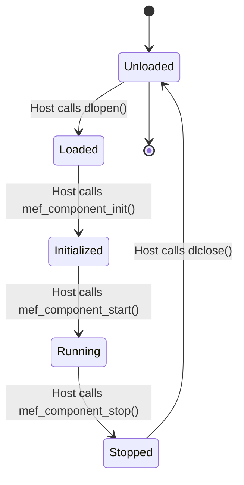

# Plugin Development Guide

**Version:** 1.0  
**Last Updated:** December 3, 2025

## Table of Contents

1. [Introduction](#introduction)
2. [Plugin Architecture](#plugin-architecture)
3. [Getting Started](#getting-started)
4. [ABI Reference](#abi-reference)
5. [Plugin SDK](#plugin-sdk)
6. [Building Plugins](#building-plugins)
7. [Testing Plugins](#testing-plugins)
8. [Best Practices](#best-practices)
9. [Examples](#examples)

---

## Introduction

SunRush plugins are dynamically-loadable shared libraries (`.so` files on Linux, `.dylib` on macOS) that implement specific functionality within the SunRush system. Plugins communicate with the host through a stable C ABI and exchange messages via an in-process message bus.

### Why Plugins?

- **Hot Reload**: Update components without restarting the system
- **Isolation**: Plugin crashes don't affect other components
- **Modularity**: Develop and test components independently
- **Binary Compatibility**: Stable ABI across versions
- **Flexibility**: Mix different Rust versions or even languages

---

## Plugin Architecture

### Plugin Lifecycle



### Required Exports

Every plugin must export these C functions:

```c
// Initialize the plugin
void* mef_component_init(
    const HostCallbacks* callbacks,
    const char* config_json
);

// Start the plugin's main processing
int mef_component_start(void* handle);

// Stop the plugin gracefully
int mef_component_stop(void* handle);

// Get plugin metadata
const char* mef_component_info();

// Get ABI version (for compatibility checking)
uint32_t mef_component_abi_version();
```

### Host Callbacks

The host provides these callbacks to plugins:

```c
typedef struct {
    // Logging
    void (*log_trace)(const char* component, const char* msg);
    void (*log_debug)(const char* component, const char* msg);
    void (*log_info)(const char* component, const char* msg);
    void (*log_warn)(const char* component, const char* msg);
    void (*log_error)(const char* component, const char* msg);
    
    // Message Bus
    int (*publish)(uint8_t msg_type, const void* data, size_t len);
    void* (*subscribe)(uint8_t msg_type);
    int (*recv)(void* subscription, void* out_buffer, size_t* out_len);
    void (*unsubscribe)(void* subscription);
    
    // Metrics
    void (*counter_inc)(const char* name);
    void (*counter_add)(const char* name, uint64_t value);
    void (*gauge_set)(const char* name, double value);
    void (*histogram_observe)(const char* name, double value);
    
    // Configuration
    const char* (*get_config)(const char* key);
} HostCallbacks;
```

---

## Getting Started

### Prerequisites

- Rust 1.70+
- SunRush plugin SDK: `cargo add sunrush-plugin-sdk`
- Understanding of C FFI in Rust

### Project Setup

Create a new plugin project:

```bash
cargo new --lib my-plugin
cd my-plugin
```

Update `Cargo.toml`:

```toml
[package]
name = "my-plugin"
version = "0.1.0"
edition = "2021"

[lib]
crate-type = ["cdylib"]  # Important: Build as dynamic library

[dependencies]
sunrush-plugin-sdk = { path = "../crates/plugin-sdk" }
sunrush-types = { path = "../crates/types" }
tokio = { version = "1", features = ["full"] }
serde = { version = "1", features = ["derive"] }
serde_json = "1"
tracing = "0.1"
```

### Minimal Plugin Example

```rust
// src/lib.rs
use sunrush_plugin_sdk::*;
use std::ffi::{CStr, CString};
use std::os::raw::c_char;

struct MyPlugin {
    host: HostHandle,
    config: PluginConfig,
}

impl MyPlugin {
    fn new(host: HostHandle, config: PluginConfig) -> Self {
        host.log_info("MyPlugin initialized");
        Self { host, config }
    }
    
    fn start(&mut self) -> Result<(), PluginError> {
        self.host.log_info("MyPlugin starting");
        
        // Subscribe to messages
        let mut rx = self.host.subscribe_transactions()?;
        
        // Process messages
        tokio::spawn(async move {
            while let Some(tx) = rx.recv().await {
                // Process transaction
                println!("Received tx: {:?}", tx.signature);
            }
        });
        
        Ok(())
    }
    
    fn stop(&mut self) {
        self.host.log_info("MyPlugin stopping");
    }
}

// Plugin state holder
static mut PLUGIN: Option<Box<MyPlugin>> = None;

#[no_mangle]
pub extern "C" fn mef_component_init(
    callbacks: *const HostCallbacks,
    config: *const c_char,
) -> *mut std::ffi::c_void {
    let host = unsafe { HostHandle::from_raw(callbacks) };
    
    let config_str = unsafe {
        CStr::from_ptr(config).to_str().unwrap_or("{}")
    };
    
    let config: PluginConfig = serde_json::from_str(config_str)
        .unwrap_or_default();
    
    let plugin = Box::new(MyPlugin::new(host, config));
    
    unsafe {
        PLUGIN = Some(plugin);
        PLUGIN.as_mut().unwrap() as *mut MyPlugin as *mut std::ffi::c_void
    }
}

#[no_mangle]
pub extern "C" fn mef_component_start(_handle: *mut std::ffi::c_void) -> i32 {
    unsafe {
        if let Some(plugin) = &mut PLUGIN {
            match plugin.start() {
                Ok(_) => 0,
                Err(e) => {
                    plugin.host.log_error(&format!("Start failed: {}", e));
                    -1
                }
            }
        } else {
            -1
        }
    }
}

#[no_mangle]
pub extern "C" fn mef_component_stop(_handle: *mut std::ffi::c_void) -> i32 {
    unsafe {
        if let Some(plugin) = &mut PLUGIN {
            plugin.stop();
            0
        } else {
            -1
        }
    }
}

#[no_mangle]
pub extern "C" fn mef_component_info() -> *const c_char {
    static INFO: &str = r#"{"name":"my-plugin","version":"0.1.0"}"#;
    INFO.as_ptr() as *const c_char
}

#[no_mangle]
pub extern "C" fn mef_component_abi_version() -> u32 {
    ABI_VERSION
}
```

---

## ABI Reference

### ABI Version

Current ABI version: **1**

```rust
pub const ABI_VERSION: u32 = 1;
```

The host checks this version on plugin load. Mismatches result in load failure.

### Message Types

```rust
#[repr(u8)]
pub enum MessageType {
    Shred = 0,
    SlotEntry = 1,
    Block = 2,
    Transaction = 3,
}
```

### Data Layout

All messages are serialized using a standard format:

```
[4 bytes: length][n bytes: bincode-encoded payload]
```

Example:

```rust
use bincode;

// Publish
let tx = MefTransaction { /* ... */ };
let encoded = bincode::serialize(&tx)?;
host.publish(MessageType::Transaction, &encoded)?;

// Receive
let data = host.recv(subscription)?;
let tx: MefTransaction = bincode::deserialize(&data)?;
```

---

## Plugin SDK

The SunRush Plugin SDK (`sunrush-plugin-sdk`) provides safe Rust wrappers around the C ABI.

### HostHandle

Main interface for plugins to interact with the host:

```rust
pub struct HostHandle {
    callbacks: *const HostCallbacks,
}

impl HostHandle {
    // Logging
    pub fn log_trace(&self, msg: &str);
    pub fn log_debug(&self, msg: &str);
    pub fn log_info(&self, msg: &str);
    pub fn log_warn(&self, msg: &str);
    pub fn log_error(&self, msg: &str);
    
    // Message Bus
    pub fn publish<T: Serialize>(
        &self,
        msg_type: MessageType,
        data: &T,
    ) -> Result<()>;
    
    pub fn subscribe_shreds(&self) -> Result<ShredReceiver>;
    pub fn subscribe_entries(&self) -> Result<EntryReceiver>;
    pub fn subscribe_blocks(&self) -> Result<BlockReceiver>;
    pub fn subscribe_transactions(&self) -> Result<TransactionReceiver>;
    
    // Metrics
    pub fn counter_inc(&self, name: &str);
    pub fn counter_add(&self, name: &str, value: u64);
    pub fn gauge_set(&self, name: &str, value: f64);
    pub fn histogram_observe(&self, name: &str, value: f64);
    
    // Configuration
    pub fn get_config(&self, key: &str) -> Option<String>;
}
```

### Receivers

Type-safe message receivers:

```rust
pub struct TransactionReceiver {
    subscription: *mut c_void,
    host: HostHandle,
}

impl TransactionReceiver {
    pub async fn recv(&mut self) -> Option<MefTransaction> {
        // Async receive with deserialization
    }
    
    pub fn try_recv(&mut self) -> Option<MefTransaction> {
        // Non-blocking receive
    }
}
```

### Plugin Macros

Simplify plugin boilerplate:

```rust
use sunrush_plugin_sdk::plugin_main;

struct MyPlugin {
    host: HostHandle,
}

impl Plugin for MyPlugin {
    fn new(host: HostHandle, config: serde_json::Value) -> Self {
        Self { host }
    }
    
    fn start(&mut self) -> Result<()> {
        // Start logic
    }
    
    fn stop(&mut self) {
        // Stop logic
    }
    
    fn info() -> &'static str {
        r#"{"name":"my-plugin","version":"0.1.0"}"#
    }
}

plugin_main!(MyPlugin);
```

This generates all required exports automatically.

---

## Building Plugins

### Development Build

```bash
cargo build
```

Output: `target/debug/libmy_plugin.so`

### Release Build

```bash
cargo build --release
```

Output: `target/release/libmy_plugin.so`

### Installation

Copy to plugin directory:

```bash
cp target/release/libmy_plugin.so /opt/sunrush/plugins/
```

### Hot Reload

If the host is running with hot reload enabled:

```bash
# Rebuild plugin
cargo build --release

# Copy to plugin directory (host will detect and reload)
cp target/release/libmy_plugin.so /opt/sunrush/plugins/
```

---

## Testing Plugins

### Unit Tests

Test plugin logic without ABI:

```rust
#[cfg(test)]
mod tests {
    use super::*;
    
    #[test]
    fn test_plugin_logic() {
        let mock_host = MockHostHandle::new();
        let plugin = MyPlugin::new(mock_host, Default::default());
        
        // Test plugin behavior
        assert!(plugin.process_data(&[1, 2, 3]).is_ok());
    }
}
```

### Integration Tests

Test with actual host:

```rust
// tests/integration.rs
use sunrush_test_harness::*;

#[tokio::test]
async fn test_plugin_integration() {
    let harness = TestHarness::new()
        .with_plugin("my-plugin", "target/debug/libmy_plugin.so")
        .build()
        .await;
    
    // Publish test message
    harness.publish_transaction(test_tx()).await;
    
    // Verify plugin behavior
    let output = harness.wait_for_output(Duration::from_secs(1)).await;
    assert!(output.contains("processed"));
}
```

### Mock Host

```rust
pub struct MockHostHandle {
    logs: Arc<Mutex<Vec<String>>>,
    metrics: Arc<Mutex<HashMap<String, f64>>>,
}

impl MockHostHandle {
    pub fn new() -> Self {
        Self {
            logs: Arc::new(Mutex::new(Vec::new())),
            metrics: Arc::new(Mutex::new(HashMap::new())),
        }
    }
    
    pub fn get_logs(&self) -> Vec<String> {
        self.logs.lock().unwrap().clone()
    }
    
    pub fn get_metric(&self, name: &str) -> Option<f64> {
        self.metrics.lock().unwrap().get(name).copied()
    }
}
```

---

## Best Practices

### 1. Error Handling

Always handle errors gracefully:

```rust
impl MyPlugin {
    fn process(&mut self, data: &[u8]) -> Result<()> {
        match self.parse(data) {
            Ok(parsed) => self.handle(parsed),
            Err(e) => {
                self.host.log_error(&format!("Parse error: {}", e));
                self.host.counter_inc("parse_errors_total");
                // Don't crash - continue processing
                Ok(())
            }
        }
    }
}
```

### 2. Logging

Use structured logging with context:

```rust
self.host.log_info(&format!(
    "Processing slot {} with {} shreds",
    slot,
    shred_count
));
```

### 3. Metrics

Emit comprehensive metrics:

```rust
impl MyPlugin {
    fn process(&mut self, tx: MefTransaction) {
        let start = Instant::now();
        
        // Process
        self.handle_transaction(&tx);
        
        // Record metrics
        self.host.counter_inc("transactions_processed_total");
        self.host.histogram_observe(
            "processing_latency_ms",
            start.elapsed().as_secs_f64() * 1000.0
        );
    }
}
```

### 4. Memory Management

Avoid leaks and unbounded growth:

```rust
struct MyPlugin {
    // Use bounded cache
    cache: LruCache<u64, Data>,
}

impl MyPlugin {
    fn new(host: HostHandle, config: Config) -> Self {
        Self {
            cache: LruCache::new(config.max_cache_size),
        }
    }
}
```

### 5. Graceful Shutdown

Clean up resources in `stop()`:

```rust
impl MyPlugin {
    fn stop(&mut self) {
        // Cancel background tasks
        if let Some(handle) = self.task_handle.take() {
            handle.abort();
        }
        
        // Flush buffers
        self.flush_pending_data();
        
        // Log shutdown
        self.host.log_info("Plugin stopped gracefully");
    }
}
```

### 6. Configuration

Use typed configuration:

```rust
#[derive(Deserialize)]
struct PluginConfig {
    #[serde(default = "default_buffer_size")]
    buffer_size: usize,
    
    #[serde(default)]
    enable_feature: bool,
}

fn default_buffer_size() -> usize { 1024 }
```

### 7. Thread Safety

Ensure thread-safe access to shared state:

```rust
use std::sync::{Arc, Mutex};

struct MyPlugin {
    shared_state: Arc<Mutex<State>>,
}

impl MyPlugin {
    fn update_state(&self, value: u64) {
        let mut state = self.shared_state.lock().unwrap();
        state.value = value;
    }
}
```

---

## Examples

### Example 1: Simple Filter Plugin

Filters transactions by program ID:

```rust
use sunrush_plugin_sdk::*;

struct FilterPlugin {
    host: HostHandle,
    target_program: Pubkey,
}

impl Plugin for FilterPlugin {
    fn new(host: HostHandle, config: serde_json::Value) -> Self {
        let target_program = config["program_id"]
            .as_str()
            .unwrap()
            .parse()
            .unwrap();
        
        Self { host, target_program }
    }
    
    fn start(&mut self) -> Result<()> {
        let mut rx = self.host.subscribe_transactions()?;
        let target = self.target_program;
        let host = self.host.clone();
        
        tokio::spawn(async move {
            while let Some(tx) = rx.recv().await {
                if tx.accounts.contains(&target) {
                    host.log_info(&format!(
                        "Matched transaction: {}",
                        tx.signature
                    ));
                    host.counter_inc("matched_transactions");
                }
            }
        });
        
        Ok(())
    }
    
    fn stop(&mut self) {}
    
    fn info() -> &'static str {
        r#"{"name":"filter","version":"1.0.0"}"#
    }
}

plugin_main!(FilterPlugin);
```

### Example 2: Metrics Aggregator

Aggregates transaction statistics:

```rust
use std::collections::HashMap;
use std::sync::{Arc, Mutex};

struct StatsPlugin {
    host: HostHandle,
    stats: Arc<Mutex<Stats>>,
}

struct Stats {
    tx_count_by_slot: HashMap<u64, u64>,
    program_counts: HashMap<Pubkey, u64>,
}

impl Plugin for StatsPlugin {
    fn new(host: HostHandle, _config: serde_json::Value) -> Self {
        Self {
            host,
            stats: Arc::new(Mutex::new(Stats {
                tx_count_by_slot: HashMap::new(),
                program_counts: HashMap::new(),
            })),
        }
    }
    
    fn start(&mut self) -> Result<()> {
        let mut rx = self.host.subscribe_transactions()?;
        let stats = Arc::clone(&self.stats);
        let host = self.host.clone();
        
        // Collector task
        tokio::spawn(async move {
            while let Some(tx) = rx.recv().await {
                let mut stats = stats.lock().unwrap();
                
                // Count by slot
                *stats.tx_count_by_slot.entry(tx.slot).or_insert(0) += 1;
                
                // Count by program
                for account in &tx.accounts {
                    *stats.program_counts.entry(*account).or_insert(0) += 1;
                }
            }
        });
        
        // Reporter task
        let stats = Arc::clone(&self.stats);
        tokio::spawn(async move {
            let mut interval = tokio::time::interval(Duration::from_secs(10));
            loop {
                interval.tick().await;
                
                let stats = stats.lock().unwrap();
                host.gauge_set(
                    "active_slots",
                    stats.tx_count_by_slot.len() as f64
                );
                host.gauge_set(
                    "tracked_programs",
                    stats.program_counts.len() as f64
                );
            }
        });
        
        Ok(())
    }
    
    fn stop(&mut self) {}
    
    fn info() -> &'static str {
        r#"{"name":"stats","version":"1.0.0"}"#
    }
}

plugin_main!(StatsPlugin);
```

### Example 3: Data Export Plugin

Exports transactions to external system:

```rust
use tokio::sync::mpsc;

struct ExportPlugin {
    host: HostHandle,
    tx_queue: mpsc::Sender<MefTransaction>,
}

impl Plugin for ExportPlugin {
    fn new(host: HostHandle, config: serde_json::Value) -> Self {
        let (tx, rx) = mpsc::channel(1000);
        
        // Start exporter task
        let endpoint = config["endpoint"].as_str().unwrap().to_string();
        tokio::spawn(Self::exporter_task(rx, endpoint));
        
        Self {
            host,
            tx_queue: tx,
        }
    }
    
    fn start(&mut self) -> Result<()> {
        let mut rx = self.host.subscribe_transactions()?;
        let tx_queue = self.tx_queue.clone();
        let host = self.host.clone();
        
        tokio::spawn(async move {
            while let Some(tx) = rx.recv().await {
                if tx_queue.send(tx).await.is_err() {
                    host.log_error("Export queue full");
                    host.counter_inc("export_queue_full");
                }
            }
        });
        
        Ok(())
    }
    
    fn stop(&mut self) {}
    
    fn info() -> &'static str {
        r#"{"name":"export","version":"1.0.0"}"#
    }
}

impl ExportPlugin {
    async fn exporter_task(
        mut rx: mpsc::Receiver<MefTransaction>,
        endpoint: String,
    ) {
        let client = reqwest::Client::new();
        
        while let Some(tx) = rx.recv().await {
            let payload = serde_json::to_string(&tx).unwrap();
            
            if let Err(e) = client
                .post(&endpoint)
                .body(payload)
                .send()
                .await
            {
                eprintln!("Export failed: {}", e);
            }
        }
    }
}

plugin_main!(ExportPlugin);
```

---

## Advanced Topics

### Custom Message Types

Add new message types to the bus:

```rust
// In your plugin
#[derive(Serialize, Deserialize)]
struct CustomAlert {
    slot: u64,
    severity: u8,
    message: String,
}

impl MyPlugin {
    fn emit_alert(&self, alert: CustomAlert) {
        self.host.publish(MessageType::Custom(100), &alert).unwrap();
    }
}
```

### Plugin Dependencies

Plugins can depend on messages from other plugins:

```rust
// Plugin A emits custom events
impl PluginA {
    fn process(&self) {
        let event = ProcessedEvent { /* ... */ };
        self.host.publish(MessageType::Custom(200), &event).unwrap();
    }
}

// Plugin B consumes those events
impl PluginB {
    fn start(&mut self) {
        let mut rx = self.host.subscribe_custom(200)?;
        // Process events from Plugin A
    }
}
```

### Performance Optimization

Use batching for high-throughput scenarios:

```rust
impl MyPlugin {
    async fn batch_processor(&mut self) {
        let mut batch = Vec::with_capacity(100);
        let mut rx = self.host.subscribe_transactions()?;
        
        loop {
            // Collect batch
            while batch.len() < 100 {
                match timeout(Duration::from_millis(10), rx.recv()).await {
                    Ok(Some(tx)) => batch.push(tx),
                    _ => break,
                }
            }
            
            if !batch.is_empty() {
                self.process_batch(&batch);
                batch.clear();
            }
        }
    }
}
```

---

## Troubleshooting

### Plugin Won't Load

Check:
1. ABI version compatibility
2. Export symbols present: `nm -D libmy_plugin.so | grep mef_component`
3. Dependencies resolved: `ldd libmy_plugin.so`
4. Correct file permissions

### Plugin Crashes

- Use `RUST_BACKTRACE=1` for stack traces
- Check host logs for panic messages
- Verify thread safety of shared state
- Test with mock host first

### Hot Reload Issues

- Ensure plugin stops cleanly
- Check for lingering threads
- Verify no circular dependencies
- Wait for in-flight messages to complete

---

## Resources

- [ABI Reference](API_REFERENCE.md)
- [Architecture Documentation](ARCHITECTURE.md)
- [Example Plugins](../plugins/)
- [Plugin SDK Source](../crates/plugin-sdk/)

---

**Happy plugin development! 🚀**
